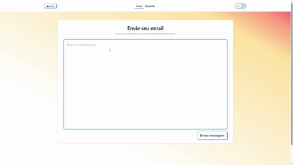

# 📧 Email IA — Classificação e Respostas Inteligentes


Projeto **full stack** que utiliza **Inteligência Artificial** para **classificar emails** e **sugerir respostas automáticas**, com frontend em **React** e backend em **FastAPI**.

---

## 🎥 Demonstração

<p align="center">
  
</p>


## 🌐 Deploy

O projeto já está disponível online:  

👉 **[Acesse aqui o Email IA](https://email-ia-production.up.railway.app/)** 🚀


## 🧠 Funcionalidades

- 📩 Envio de emails para análise
- 🏷️ Classificação automática por categoria
- 🤖 Geração de resposta sugerida por IA
- 📋 Histórico de emails processados
- 📄 Listagem com paginação
- 📌 Copiar resposta sugerida com um clique

---

## 🧩 Tecnologias Utilizadas

### 🖥️ Frontend
- ⚛️ React
- ⚡ Vite
- 🎨 Tailwind CSS
- 📡 Axios

### 🧠 Backend
- 🐍 Python
- 🚀 FastAPI
- 🔐 OpenAI API
- 🗄️ SQLAlchemy
- 🐘 PostgreSQL (produção)
- 🧪 SQLite (desenvolvimento)

---

## 🚀 Como rodar o projeto localmente

Este projeto é dividido em **Frontend** e **Backend**.  
Ambos devem ser iniciados separadamente.

---

# 🖥️ Frontend — Interface Web


Interface responsável pela **interação do usuário**, envio de emails e visualização das respostas.

### ▶️ Como rodar o Frontend

  ```bash
  cd frontend
  npm install
  npm run dev
  ```

# 🧠 Backend — API Inteligente


Responsável pela classificação dos emails e geração das respostas automáticas via IA.

### ▶️ Como rodar o Backend

  ```bash
  cd backend
  python -m venv venv venv\Scripts\activate
  pip install -r requirements.txt
  uvicorn main:app --reload
  ```
